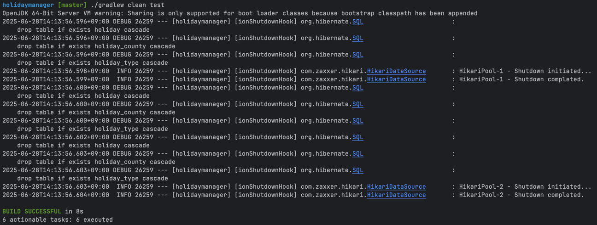

# 전 세계 공휴일 관리
- nager.date 참조하여 공휴일 관리(https://date.nager.at)

## 설치 방법
### 설치 전 준비
- 설치 환경: linux
- 운영 환경: jdk 21
- 설치 파일 구성
    - docker-compose.yml: docker compose 설정 파일
    - Dockerfile: docker 이미지 설정 파일
    - start.sh: 전체 설치 과정이 정의된 파일(이 파일만 실행하면 설치 및 구동함)
- 사전 준비(준비된 경우 아래 설치로)
    - docker 및 docker compose 설치
        - docker 설치 참조: https://docs.docker.com/engine/install
        - docker compose 설치 참조: https://docs.docker.com/compose/install

### 설치
```shell
$ sh start.sh
```
- 본 시스템은 포트 8080번을 사용하는데, 만약 포트 8080번이 이미 사용 중일 경우, 본 소스의 docker-compose.yml 파일 변경 후 다시 시도
    - app 서비스 ports 항목의 "8080:8080" 중 앞 숫자를 바꾸고 싶은 포트로 변경한 후 다시 시도(ex. 8000으로 변경할 경우 "8000:8080")
- 설치 완료 후 포트포워딩
  - 포트포워딩을 완료해야 프론트엔드에서 사용 가능(localhost 안됨). 포트포워딩한 주소 정보를 프론트엔드에서 사용함(프론트엔드 소스의 README.md 참조)

### 설치 완료 확인
- 아래 명령어를 실행하여 구동중인 컨테이너에 holidaymanager가 있으면 설치 완료됨
```shell
$ docker ps --filter "name=holidaymanager"
```
- 다만 상기 명령어는 컨테이너가 설치된 것을 의미하며 이후 구동까지는 시간이 더 걸릴 수 있음

### 설치 실패 대응법
- Error response from daemon: driver failed... port is already in use
    - 설치하려는 port가 이미 사용중임. 상기 설치의 포트 변경 방법을 참고하여 다시 설치

### 테스트
- 브라우저의 주소창에 설치한 호스트 주소(아래 예시의 api-host 부분) 및 포트(아래 예시는 기본값인 8080번을 사용. 상기 설치 과정에서 변경한 경우는 변경한 번호를 사용해야 함), 사용할 api(GET만 가능) 주소를 입력하여 테스트
```
### 공휴일 조회 api 테스트
http://api-host:8080/api/holidays/2025/KR
```

### 수동 빌드 & 실행
- 상기 docker 방식 외 아래와 같이 gradle을 통해 수동 실행 가능(8080 포트로 실행됨)
```shell
$ ./gradlew bootRun
```

- gradle 테스트: 테스트 코드를 일괄 테스트(아래는 결과 스크린샷)
```shell
$ ./gradlew clean test
```


## 문서화
- 아래 주소로 swagger 문서 페이지로 접근 가능
```text
http://localhost:{PORT}/swagger-ui/index.html
```

## API
### 연도별 국가별 조회
- Request
    - url: GET /api/holidays/{year}/{countryCode}
        - year: 연도(yyyy)
        - countryCode: 국가 코드(ISO 3166-1 alpha-2)
    - query parameters
        - page: 페이지 번호(필수 아님, 1부터 시작, 기본값 1)
        - size: 페이지별 항목 수(필수 아님, 기본값 10)
        - from: 월 시작(값 포함. 필수 아님)
        - to: 월 종료(값 포함. 필수 아님)
        - types: 공휴일 유형(string list). 필수 아님. 존재 시 OR 조건으로 적용됨
            - Public: 법정 공휴일
            - Bank: 은행 휴업일
            - School: 학교 휴일
            - Authorities: 관공서 공휴일
            - Optional: 선택적 휴일
            - Observance: 기념일
    - body: (없음)
    - example
        ```
        GET /api/holidays/2025/KR?page=1&size=3&from=10&types=Public&types=Optional
        ```
- Response
    - 성공
        - http status code: 200 ok
        - body(object)
            - page: 검색된 페이지 번호(1부터 시작)
            - size: 페이지별 항목 수
            - totalPages: 전체 페이지 수
            - totalElements: 전체 항목 수
            - isFirst: 첫 페이지인지 여부
            - isLast: 마지막 페이지인지 여부
            - content: 조회된 데이터 목록(object list). date 오름차순 정렬됨
                - countryCode: 국가 코드(ISO 3166-1 alpha-2)
                - date: 날짜(yyyy-MM-dd)
                - localName: 공휴일 이름(해당 국가 언어 표기)
                - name: 공휴일 이름(영문 표기)
                - global: 국가 전체 휴일 여부(boolean)
                - launchYear: 최초 적용 연도(yyyy 또는 null)
                - counties: 적용되는 state code list(ISO 3166-2 list. 빈 배열일 경우 국가 전체에 적용됨)
                - types: 공휴일 유형(string list)
                    - Public: 법정 공휴일
                    - Bank: 은행 휴업일
                    - School: 학교 휴일
                    - Authorities: 관공서 공휴일
                    - Optional: 선택적 휴일
                    - Observance: 기념일
        - example
            ```json
            {
              "page": 1,
              "size": 3,
              "totalPages": 2,
              "totalElements": 6,
              "isFirst": true,
              "isLast": false,
              "content": [{
                "countryCode": "KR",
                "date": "2025-10-03",
                "localName": "개천절",
                "name": "National Foundation Day",
                "global": true,
                "launchYear": null,
                "counties": [],
                "types": ["Public"]
              }, {
                "countryCode": "KR",
                "date": "2025-10-06",
                "localName": "추석",
                "name": "Chuseok",
                "global": true,
                "launchYear": null,
                "counties": [],
                "types": ["Public"]
              }, {
                "countryCode": "KR",
                "date": "2025-10-07",
                "localName": "추석",
                "name": "Chuseok",
                "global": true,
                "launchYear": null,
                "counties": [],
                "types": ["Public"]
              }]
            }
            ```
    - 실패 http status code
        - 400 bad request: 전달된 정보가 유효하지 않음
        - 500 internal server error: 서버 오류

### 재동기화
- Request
    - url: POST /api/holidays/{year}/{countryCode}/refresh
        - year: 연도(yyyy)
        - countryCode: 국가 코드(ISO 3166-1 alpha-2)
    - query parameters: (없음)
    - body: (없음)
    - example
        ```
        POST /api/holidays/2025/KR/refresh
        ```
- Response
    - 성공
        - http status code: 200 ok
        - body: (없음)
    - 실패 http status code
        - 400 bad request: 전달된 정보가 유효하지 않음
        - 500 internal server error: 서버 오류

### 삭제
- Request
    - url: DELETE /api/holidays/{year}/{countryCode}
        - year: 연도(yyyy)
        - countryCode: 국가 코드(ISO 3166-1 alpha-2)
    - query parameters: (없음)
    - body: (없음)
    - example
        ```
        DELETE /api/holidays/2025/KR
        ```
- Response
    - 성공
        - http status code: 200 ok
        - body: (없음)
    - 실패 http status code
        - 400 bad request: 전달된 정보가 유효하지 않음
        - 500 internal server error: 서버 오류

## Batch
### 최근 5년의 공휴일 일괄 저장
- 애플리케이션 최초 실행 시 작동

### 매년 자동 동기화
- 매년 1월 2일 01:00 KST에 전년도, 금년도 데이터를 자동 동기화


## DB
### 설계 참고
- 국가 코드(ISO 3166-1 alpha-2) 및 국가 하위 지역 코드(ISO 3166-2)는 별도 코드 테이블을 사용하지 않음
    - 해당 코드들은 국제 표준 정보로서, 변경되거나 저장 시 유효성 오류가 발생할 가능성이 희박함
    - 서비스하는 데이터 저장 시 국가 코드 목록 조회 -> 특정 연도 특정 코드의 데이터 조회 -> 저장의 프로세스를 가지는데, 코드 목록 조회를 DB의 코드 테이블을 사용할 경우 신규 국가 코드가 추가됐는데 DB에는 반영되지 않았다면 데이터 조회 시 누락이 발생할 수 있음
    - 이를 막으려면 국가 코드를 조회하거나 재동기화를 할 때마다 코드를 최신화해야 하는데, 이미 nager.date API에서 최신화된 코드를 조회할 수 있기도 하고, 본 프로젝트 규모에서 코드 정보를 별도로 관리하는 것은 과도하다고 판단됨
    - 따라서 nager.date에서 제공하는 정보를 그대로 사용하되, 차후 국가의 부가 정보들을 직접 다루는 등 코드 이외의 정보를 관리해야 할 필요가 생기면 개선하는 것이 타당함
- 공휴일 유형은 별도 코드 테이블을 사용하지 않음
    - 공휴일 유형은 nager.date API의 분류로서 변경 가능성이 상대적으로 높음. 다만 애플리케이션에서 해당 API 데이터를 조회한 후 enum으로 변환하는 과정에서 변경 여부를 확인할 수 있으므로 별도 코드 테이블은 불필요함
- id는 DBMS마다 특화된 유형이 다른데 본 프로젝트는 h2를 사용하므로 공통 적용할 수 있는 varchar를 사용(UUID 값을 string으로 사용)
- 도메인 레벨에서 공휴일 유형, 국가 하위 지역 코드는 아이디를 사용하지 않음
  - 도메인에서는 단지 값만 필요한데 DB와의 연계를 위해 아이디를 부여해서 jpa entity와 맞추는 것은 과도함
  - 아이디가 존재하지 않으므로 DB에서 조회한 데이터에서 일부 공휴일 유형, 국가 하위 지역 코드에 변경 사항이 발생할 경우 전체 목록을 삭제하고 다시 만들어야 함. 다만 현재 특정 공휴일에 대한 공휴일 유형 추가, 국가 하위 지역 코드 추가 등 세부 조정 기능은 존재하지 않으므로 성능상 불리점은 없음
  - 차후 세부 조정이 필요할 경우 도메인 레벨에도 아이디를 부여하는 등 DB와의 연계 정보 추가 필요
  - 단, 특정 공휴일 인스턴스는 삭제할 수 있어야 하므로 holiday 도메인 모델에는 아이디를 사용
- 조회 시 항상 같은 결과를 가져오기 위해서는 types, counties까지도 확인해야 하지만 현재의 서비스 요구에 비해 과도함. 현재 date, countryCode, localName을 정렬에 사용하므로 충분하다고 판단되므로 추가하지 않음

### ERD
